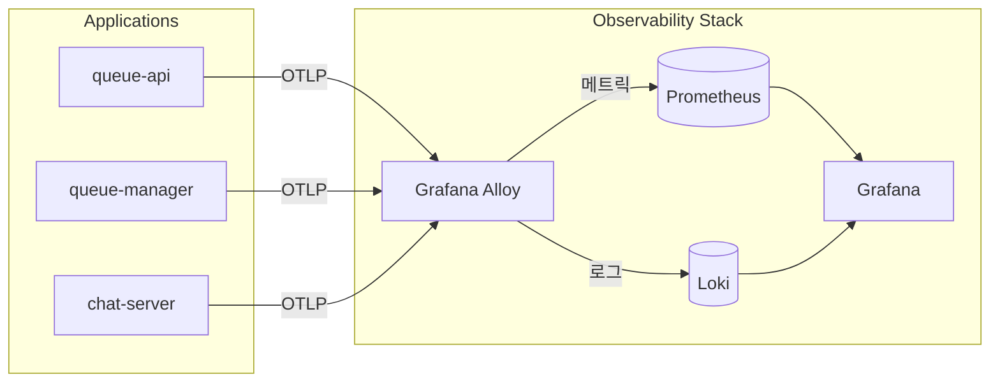

# queue-server

## 프로젝트 개요

게임 대기열 서버 시스템으로, 다음 구성요소로 이루어져 있습니다:

- **queue-api**: 대기열 API 서버 (Spring Boot)
- **queue-manager**: 대기열 관리 서버 (Spring Boot)
- **chat-server**: 채팅 서버 (.NET) - `chat/LikeLionChat.Server`
- **chat-client**: 채팅 클라이언트 (.NET WinForms) - `chat/LikeLionChat.Client`

자세한 기술 명세는 [spec.md](./spec.md)를 참조하세요.

## 로컬 개발 환경

### Docker Compose로 실행

```bash
docker-compose up --build
```

### 서비스 엔드포인트

| 서비스 | URL | 설명 |
|--------|-----|------|
| Queue API | <http://localhost:8080> | 대기열 API |
| Chat Server | <http://localhost:8081> | 채팅 서버 |
| Valkey Dashboard | <http://localhost:8082> | Redis 대시보드 |
| Grafana | <http://localhost:3000> | 모니터링 대시보드 (로그인 불필요) |
| Prometheus | <http://localhost:9090> | 메트릭 저장소 |
| Loki | <http://localhost:3100> | 로그 저장소 |
| Alloy | <http://localhost:12345> | OpenTelemetry Collector UI |

## 빌드

### Queue 서비스 (Spring Boot)

```bash
cd queue
./gradlew build
```

### Chat Server (.NET)

```bash
cd chat/LikeLionChat.Server
dotnet build
```

### Docker 이미지 빌드

```bash
# queue-api
docker build -t queue-api:dev -f queue/queue-api/Dockerfile queue/

# queue-manager
docker build -t queue-manager:dev -f queue/queue-manager/Dockerfile queue/

# chat-server
docker build -t chat-server:dev -f chat/LikeLionChat.Server/Dockerfile chat/
```

## 프로덕션 배포

프로덕션 환경(AWS EKS)에 배포하려면 [queue-infra](https://github.com/likelion-cloud-423/queue-infra) 저장소를 참조하세요.

### ECR에 이미지 푸시

```bash
# AWS ECR 로그인
aws ecr get-login-password --region ap-northeast-2 | docker login --username AWS --password-stdin <ACCOUNT_ID>.dkr.ecr.ap-northeast-2.amazonaws.com

# 이미지 태그 및 푸시
docker tag queue-api:dev <ACCOUNT_ID>.dkr.ecr.ap-northeast-2.amazonaws.com/queue-api:latest
docker push <ACCOUNT_ID>.dkr.ecr.ap-northeast-2.amazonaws.com/queue-api:latest

docker tag queue-manager:dev <ACCOUNT_ID>.dkr.ecr.ap-northeast-2.amazonaws.com/queue-manager:latest
docker push <ACCOUNT_ID>.dkr.ecr.ap-northeast-2.amazonaws.com/queue-manager:latest

docker tag chat-server:dev <ACCOUNT_ID>.dkr.ecr.ap-northeast-2.amazonaws.com/chat-server:latest
docker push <ACCOUNT_ID>.dkr.ecr.ap-northeast-2.amazonaws.com/chat-server:latest
```

## Observability

### 로컬 환경 모니터링 스택



### 대시보드

Grafana에서 다음 대시보드를 확인할 수 있습니다:

1. **Queue Server Overview** - 전체 시스템 현황
   - Queue API 요청률
   - Queue Manager 티켓 발급
   - Chat Server 연결 수
   - Valkey 메트릭

2. **Valkey Monitoring** - ElastiCache 상세 모니터링
   - 연결 클라이언트 수
   - 메모리 사용량
   - 명령 처리량
   - 캐시 히트율

### 메트릭 수집

| 서비스 | 프로토콜 | 포트 | 엔드포인트 |
|--------|----------|------|-----------|
| queue-api | OTLP HTTP | 4318 | /v1/metrics |
| queue-manager | OTLP HTTP | 4318 | /v1/metrics |
| chat-server | OTLP gRPC | 4317 | - |
| Valkey | Prometheus | 9121 | redis-exporter |

## 테스트

### 부하 테스트 (k6)

```bash
k6 run k6/chat-flow.js --vus 10 --duration 2m
```

자세한 옵션은 [k6/README.md](./k6/README.md)를 참조하세요.

### 채팅 클라이언트 테스트

```bash
cd chat/LikeLionChat.Client
dotnet run
```

## 환경 변수

### queue-api / queue-manager

| 변수 | 설명 | 기본값 |
|------|------|--------|
| SPRING_DATA_REDIS_HOST | Valkey 호스트 | localhost |
| SPRING_DATA_REDIS_PORT | Valkey 포트 | 6379 |
| OTEL_EXPORTER_OTLP_ENDPOINT | OTLP 엔드포인트 | <http://localhost:4318> |
| OTEL_SERVICE_NAME | 서비스 이름 | queue-api / queue-manager |

### chat-server

| 변수 | 설명 | 기본값 |
|------|------|--------|
| ConnectionStrings__Valkey | Valkey 연결 문자열 | localhost:6379 |
| OTEL_EXPORTER_OTLP_ENDPOINT | OTLP 엔드포인트 | <http://localhost:4317> |
| OTEL_SERVICE_NAME | 서비스 이름 | chat-server |
| ChatServer__SoftCap | 소프트 캡 | 100 |
| ChatServer__MaxCap | 최대 캡 | 120 |

## 라이센스

MIT License
