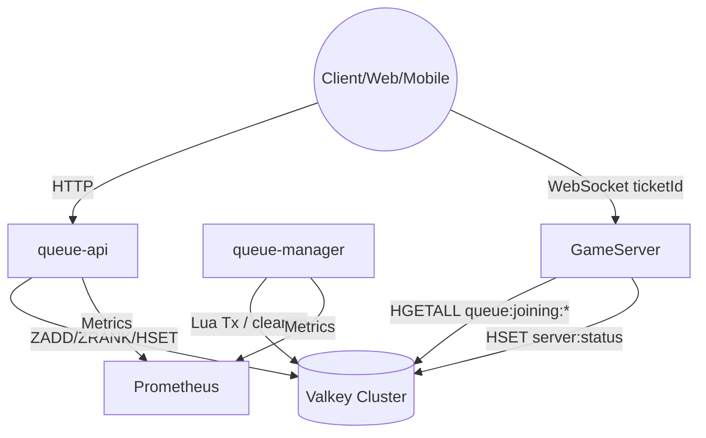
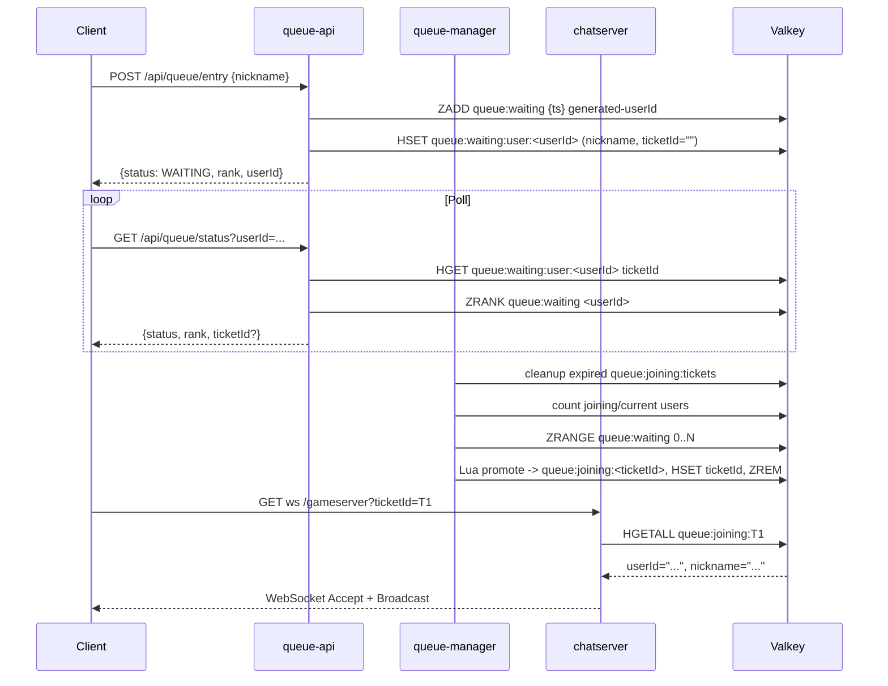

# [Spec] 쿠버네티스 기반 게임 서버 대기열 시스템

> 본 문서는 `queue-api`(Spring Boot), `queue-manager`(Spring Boot Worker), `gameserver`(ASP.NET Core ChatServer) 그리고 Valkey 기반 상태 저장소로 구성된 **Stateful 게임 서버 대기열 및 트래픽 제어 시스템**의 기술 명세 초안입니다.

---

## 1. 시스템 개요 (Overview)

본 시스템은 로그인 피크 시간에 게임 서버와 메인 DB가 직접적인 부하를 받지 않도록 **대기열(Queue)** 영역을 별도 서비스로 분리하고, 허용 가능한 동시 접속자 수만큼만 **티켓(Ticket)** 기반으로 순차 입장시키는 것을 목표로 합니다.

### 1.1 핵심 원칙

1. **MSA + Stateful Queue**: 대기열 로직을 queue-api/queue-manager로 분리하고 Valkey ZSET으로 순서를 보장합니다.
2. **일회성 티켓 검증**: queue-manager가 발급한 티켓을 ChatServer(GameServer)가 `/gameserver?ticketId=...` WebSocket handshake 단계에서 검증합니다.
3. **관측 가능성**: Web/API/Worker 전 구간에 OpenTelemetry 기반 추적과 Prometheus 메트릭을 수집합니다.
4. **보안/안정성**: API Rate Limit, Valkey TTL, Ticket 삭제를 통해 재사용 및 남용을 차단합니다.

---

## 2. 아키텍처 및 기술 스택 (Architecture & Tech Stack)

### 2.1 구성 요소 요약

| 컴포넌트 | 기술 스택 | 배포 형태 (K8s) | 역할 |
| :--- | :--- | :--- | :--- |
| **queue-api** | Spring Boot 3 | Deployment + HPA | 닉네임을 입력받아 userId 생성, Valkey에 대기열 메타 저장, 상태 폴링 응답 |
| **queue-manager** | Spring Boot 3 | Deployment (1 Replica) | 1초 주기로 ZSET 스케줄링, Lua 기반 티켓 발급, Micrometer 지표 수집 |
| **GameServer (ChatServer)** | ASP.NET 10 (Minimal API + WebSocket) | Deployment (1 Replica) | WebSocket 세션 호스팅, 티켓 검증, server:status 업데이트 |
| **Valkey** | Valkey (Redis 호환) | ElastiCache | 대기열 ZSET, queue:waiting:user 해시, queue:joining:* 티켓 Hash, server:status 저장 |
| **chat-client** | Python 3 + httpx/websockets | 로컬 | queue-api와 chat-server를 순차 호출하는 E2E 더미 클라이언트 |

### 2.3 러프 토폴로지



### 2.4 대표 시퀀스



---

## 3. 데이터 모델링

### 기본 데이터 구조

- **유저 정보**

    ```json5
    {
        "userId": "string", // 유저 아이디
        "nickname": "string" // 닉네임
    }
    ```

- **접속 티켓**

    ```json5
    {
        "ticketId": "string", // UUID
        "user": {
            "userId": "string",
            "nickname": "string"
        }
    }
    ```

### Valkey 설계

- **대기열 (Waiting Queue)**
  - **Type**: Sorted Set (ZSET)
  - **Key**: `queue:waiting`
  - **Score**: `requestEpochMillis` (작을수록 먼저 입장)
  - **Member**: `userId`
  - **TTL**: 60초 (queue-manager 발급 시 `EX` 지정)

- **대기열 유저 정보 (User Info)**
  - **Type**: Hash
  - **Key**: `queue:waiting:user:<userId>`
  - **Fields**: `userId`, `nickname`, `ticketId` (초기값 empty)
  - **TTL**: 10분 (폴링 최적화용)

- **진입 예정 티켓 목록 (Scheduled Tickets)**
  - **Type**: Sorted Set (ZSET)
  - **Key**: `queue:joining:tickets`
  - **Score**: `expireAt` (티켓 만료 시간)
  - **Member**: `ticketId`
  - **용도**: 현재 게임서버 접속자 수(`current_users`)와 합산하여 총 활성 유저 수 계산 (ZCOUNT로 O(1) 카운트)

- **진입 예정 티켓 정보 (Ticket Info)**
  - **Type**: Hash
  - **Key**: `queue:joining:<ticketId>`
  - **Fields**:
    - `ticketId`
    - `userId`
    - `nickname`
  - **TTL**: 60초 (티켓 발급 후 1분 이내 게임서버 접속해야 함)
  - **용도**: 게임서버에서 티켓 검증 및 유저 정보 조회

#### 서버 상태 (Server Status)

- **Type**: Hash
- **Key**: `server:status`
- **Fields**:
  - `current_users`: 현재 연결된 세션 수
  - `soft_cap`: GameServer가 동적으로 설정하는 소프트 한계치 (티켓 발급 기준)
  - `max_cap`: 운영 상의 절대 상한 (필요 시 fallback)
- **업데이트 주기**: GameServer가 실시간 업데이트

---

## 4. 핵심 프로세스 및 로직 (Core Logic)

### 4.1 대기열 진입 (Client → queue-api)

1. **API**: `POST /api/queue/entry`
2. **Request Body**:

    ```json5
    {
         "nickname": "string"
    }
    ```

3. **동작**:
     - `userId` 랜덤 생성 (UUID로 생성)
     - Valkey `ZADD queue:waiting score timestamp userId NX` (중복 방지)
     - `queue:waiting:user:<userId>` Hash에 유저 정보 저장 (`userId`, `nickname`, `ticketId`="") (TTL 10m)
4. **Response Body**:

    ```json5
    {
        "status": "WAITING",
        "rank": 1200,
        "userId": "generated-uuid"
    }
    ```

5. **에러**: Valkey 장애 시 503

### 4.2 상태 폴링 (Client → queue-api)

1. **API**: `GET /api/queue/status?userId=...`
2. **순번 확인**: `ZRANK queue:waiting {userId}`
3. **티켓 감지**: `queue:waiting:user:<userId>` Hash의 `ticketId` 필드가 채워져 있는지 확인
4. **Response Body**:

    ```json5
    {
        "status": "PROMOTED",
        "rank": 0,
        "ticketId": "1a2b-..."
    }
    ```

### 4.3 스케줄링 및 티켓 발급 (queue-manager)

- **주기**: 1초 (configurable)
- **알고리즘**:
    1. **만료된 티켓 정리**:
       - `now = current timestamp (epoch millis)`
       - `ZREMRANGEBYSCORE queue:joining:tickets 0 {now}` (만료된 티켓 ID 제거)
       - 정리된 티켓 수를 Prometheus 카운터 `ticket_expired_count`에 기록

2. **현재 상태 조회**:
       - `current_users`: 게임서버 현재 접속자 수 (`server:status` Hash)
       - `joining_users`: 티켓은 발급되었으나 아직 접속하지 않은 유저 수 (Valkey `ZCOUNT queue:joining:tickets {now} +inf`)
       - `soft_cap`: GameServer가 설정한 소프트 한계치 (`server:status` Hash의 `soft_cap`, 없으면 `max_cap` 또는 기본값)
3. **입장 가능 인원 계산**:
       - `total_active = current_users + joining_users`
       - `available_slots = soft_cap - total_active`
    4. **배치 처리**:
       - `batch = min(available_slots, 100)` (100은 hard limit)
       - `if batch > 0`:
         - `candidates = ZRANGE queue:waiting 0 batch-1`
         - Lua Script 실행 (각 유저마다):
             - `ticketId = {ticketId}` 생성 (ticketId는 UUID)
             - `userInfo = HGETALL queue:waiting:user:userId` (유저 정보 조회)
             - `HSET queue:joining:ticketId ticketId/userId/nickname` (티켓 Hash 저장) + `EXPIRE 60`
             - `ZADD queue:joining:tickets {expireAt} ticketId` (티켓 목록에 추가)
             - `HSET queue:waiting:user:userId ticketId ticketId` (유저에게 티켓 ID 업데이트)
             - `ZREM queue:waiting userId` (대기열에서 제거)
    5. Prometheus 카운터 `ticket_issued_count++`

### 4.4 게임 서버 접속 및 검증 (Client → ChatServer)

1. **티켓 전달 (Client)**:
   - 유저는 `queue-api` 폴링을 통해 획득한 `ticketId`를 사용하여 게임서버에 접속을 시도합니다.
   - **엔드포인트**: WebSocket `GET /gameserver?ticketId={ticketId}` (`chatserver/Program.cs`)

2. **티켓 검증 및 유저 정보 조회 (GameServer)**:
   - **사전 검증**: QueryString `ticketId` 누락 시 401 Unauthorized 반환.
   - **Valkey 조회**:
     - `HGETALL queue:joining:{ticketId}`를 실행하여 티켓 존재 여부를 확인합니다.
     - Hash 필드(`userId`, `nickname`, `ticketId`)를 사용해 `User` 객체를 구성합니다.
     - TTL이 설정된 Hash 키이므로 HGETALL 성공 시 자동으로 유효성이 보장됩니다.
     - 티켓이 없거나 만료된 경우(HGETALL 결과 empty) 연결 거부.

3. **유저 설정 및 입장 처리 (GameServer)**:
   - **유저 세션 생성**: 획득한 `User` 정보를 기반으로 `ChatServer` 내 클라이언트 객체를 생성하고 `_clients` 딕셔너리에 등록합니다.
   - **입장 알림**: 해당 유저의 입장을 다른 클라이언트들에게 브로드캐스트합니다.

4. **상태 업데이트 (GameServer → Valkey)**:
   - **연결 성공 시**:
     - `HINCRBY server:status current_users 1` (현재 접속자 수 증가)
     - `DEL queue:joining:{ticketId}` (티켓 정보 삭제)
     - `ZREM queue:joining:tickets {ticketId}` (진입 예정 목록에서 제거)
     - `DEL queue:waiting:user:<userId>` (대기열 유저 정보 삭제)
   - **보안 조치**: 사용된 티켓은 `queue:joining:{ticketId}` Hash 키와 `queue:joining:tickets` ZSET에서 모두 제거되므로 재사용이 불가능합니다.

5. **연결 유지 및 종료**:
   - **Idle Disconnect**: 2분 이상 메시지 송수신이 없으면 연결을 종료합니다.
   - **연결 종료 시**: `HINCRBY server:status current_users -1` (현재 접속자 수 감소)

---

## 5. WebSocket 메시지 프로토콜 (ChatServer)

### 5.1 기본 프레임 구조

- 모든 WebSocket 프레임은 UTF-8 JSON 텍스트이며 다음 공통 포맷을 따른다.

```json5
{
  "type": "MESSAGE_SEND",
  "payload": { /* 메시지별 스키마 */ }
}
```

- `type`는 대문자 스네이크 케이스 문자열이며, 서버·클라이언트가 사용하는 열거형 `WebSocketMessageTypes`와 1:1로 매핑된다.
- `payload`는 메시지 종류별로 정의된 JSON 객체다. 비어 있는 경우 `{}`로 전송된다.

### 5.2 메시지 타입 및 스키마

| Type                     | 방향              | 설명                             | Payload 스키마                                                                     |
|--------------------------|-----------------|--------------------------------|---------------------------------------------------------------------------------|
| `MESSAGE_SEND`           | Client → Server | 사용자가 채팅 메시지를 전송                | `{ "message": string }`                                                         |
| `MESSAGE_RECEIVE`        | Server → Client | 다른 사용자가 보낸 메시지 브로드캐스트          | `{ "timestamp": string(ISO-8601, UTC), "nickname": string, "message": string }` |
| `SYSTEM_MESSAGE_RECEIVE` | Server → Client | 입장/퇴장 등 시스템 공지                 | `{ "timestamp": string(ISO-8601, UTC), "message": string }`                     |
| `SERVERSTATUS_REQUEST`   | Client → Server | 현재 접속자 수를 요청 (`payload`는 빈 객체) | `{}`                                                                            |
| `SERVERSTATUS_RESPONSE`  | Server → Client | 현재 접속자 수 응답                    | `{ "clientCount": number }`                                                     |

### 5.3 예시 시나리오

1. **클라이언트 송신**
    ```json5
    {
      "type": "MESSAGE_SEND",
      "payload": {
        "message": "안녕하세요!"
      }
    }
    ```
2. **서버 브로드캐스트**
    ```json5
    {
      "type": "MESSAGE_RECEIVE",
      "payload": {
        "timestamp": "2024-05-26T02:13:45.123Z",
        "nickname": "라이언",
        "message": "안녕하세요!"
      }
    }
    ```
3. **서버 상태 조회**
   - 요청: `{ "type": "SERVERSTATUS_REQUEST", "payload": {} }`
   - 응답: `{ "type": "SERVERSTATUS_RESPONSE", "payload": { "clientCount": 42 } }`

새로운 메시지 타입을 도입할 때에도 동일한 Envelope(`type` + `payload`) 구조를 유지하고, camelCase 직렬화 규칙을 따른다.

---
