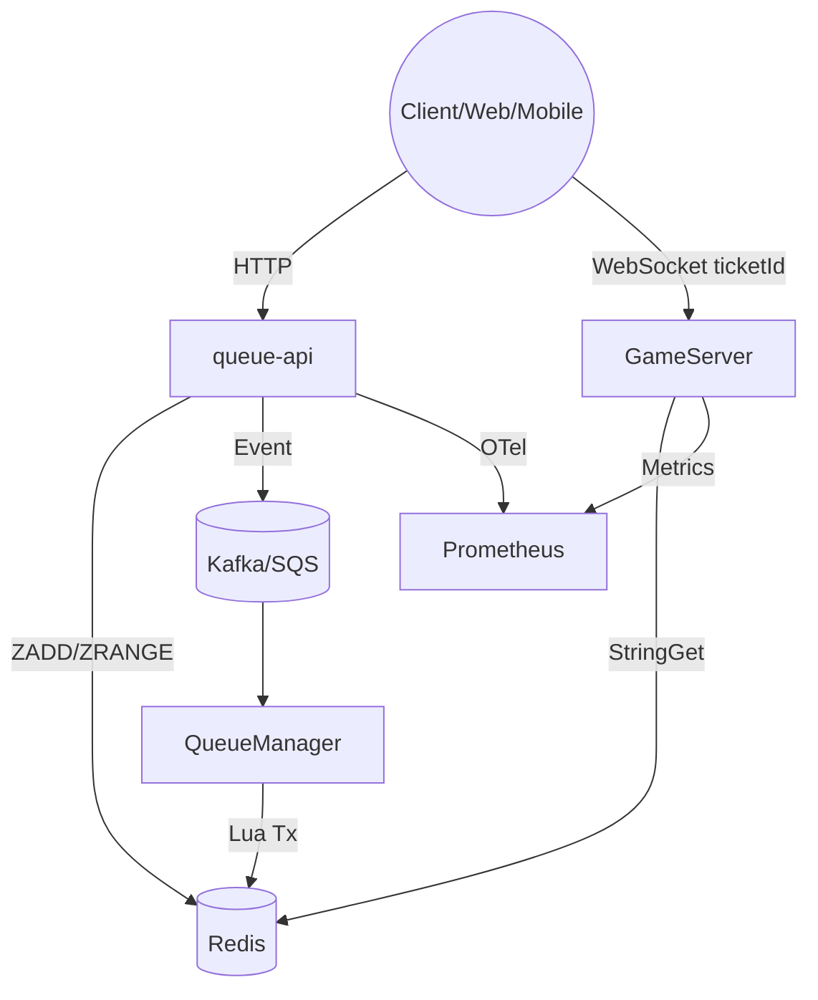
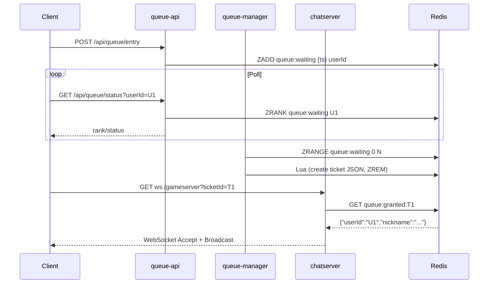

# [Spec] Kubernetes 기반 Stateful MMORPG 대기열 시스템

| 문서 버전 | v1.0 | 작성일 | 2025-11-26 |
| :--- | :--- | :--- | :--- |
| **목표** | 대규모 트래픽 격리, 순차적 입장 처리, 게임 서버 보호 | **대상** | Backend, Client, DevOps |

> 본 문서는 `queue-api`(Spring Boot), `queue-manager`(Spring Boot Worker), `gameserver`(ASP.NET Core ChatServer) 그리고 Redis 기반 상태 저장소로 구성된 **Stateful MMORPG 대기열 및 트래픽 제어 시스템**의 기술 명세 초안입니다. 현재 `gameserver` 컴포넌트는 `chatserver/Program.cs`, `ChatServer.cs`, `RedisTicketRepository.cs` 등에 구현되어 있으며, 다른 컴포넌트는 본 명세를 기준으로 개발합니다.

---

## 1. 시스템 개요 (Overview)

본 시스템은 로그인 피크 시간에 게임 서버와 메인 DB가 직접적인 부하를 받지 않도록 **대기열(Queue)** 영역을 별도 마이크로서비스로 격리하고, 허용 가능한 동시 접속자 수만큼만 **티켓(Ticket)** 기반으로 순차 입장시키는 것을 목표로 합니다.

### 1.1 핵심 원칙

1. **MSA + Stateful Queue**: 대기열 로직을 queue-api/queue-manager로 분리하고 Redis ZSET으로 순서를 보장합니다.
2. **일회성 티켓 검증**: queue-manager가 발급한 티켓을 ChatServer(GameServer)가 `/gameserver?ticketId=...` WebSocket handshake 단계에서 검증합니다.
3. **관측 가능성**: Web/API/Worker 전 구간에 OpenTelemetry 기반 추적과 Prometheus 메트릭을 수집합니다.
4. **보안/안정성**: API Rate Limit, Redis TTL, Ticket 삭제를 통해 재사용 및 남용을 차단합니다.

---

## 2. 아키텍처 및 기술 스택 (Architecture & Tech Stack)

### 2.1 구성 요소 요약

| 컴포넌트 | 기술 스택 | 배포 형태 (K8s) | 역할 |
| :--- | :--- | :--- | :--- |
| **queue-api** | Spring Boot 3.x, Java 21 | Deployment + HPA | 클라이언트 대기열 진입/폴링 API (Stateless) |
| **queue-manager** | Spring Boot 3.x Worker | Deployment (1 Replica, Leader) | ZSET 스케줄링, 티켓 발급, 유량 제어 (Stateful) |
| **GameServer (ChatServer)** | ASP.NET Core 8 (Minimal API + WebSocket) | Deployment (autoscale) | WebSocket 세션 호스팅 및 Redis 티켓 검증 |
| **Redis** | AWS ElastiCache (StackExchange.Redis) | Managed Service | 대기열 ZSET, 티켓 JSON, 서버 상태 저장 |
| **Client** | Unreal Engine 5 (HTTP + WebSocket) | - | Queue API 호출 및 게임 접속 |

### 2.2 인프라 & 모니터링

- **Cluster**: AWS EKS (Private Node Group)
- **Load Balancer**: ALB (HTTP/HTTPS) for queue-api, NLB 또는 Agones Fleet for GameServer WebSocket
- **Observability**: OpenTelemetry Collector → Prometheus/Grafana, Loki(로그), Tempo(트레이싱)
- **Secrets**: AWS Secrets Manager (Redis, JWT 키)

### 2.3 러프 토폴로지



### 2.4 대표 시퀀스



---

## 3. 데이터 모델링 (Redis Data Design)

### 3.1 대기열 (Waiting Queue)

- **Type**: Sorted Set (ZSET)
- **Key**: `queue:waiting`
- **Score**: `requestEpochMillis` (작을수록 먼저 입장)
- **Member**: `userId`
- **추가 메타**: 필요 시 `queue:waiting:meta:<userId>` Hash에 지역/채널 등 저장

### 3.2 접속 티켓 (Access Ticket)

- **Type**: String (JSON 직렬화)
- **Key**: `queue:granted:<ticketId>` (`chatserver/RedisTicketRepository.cs` 참고)
- **Value JSON Schema** (`chatserver/ChatServerTypes.cs`):

```json
{
    "userId": "string",
    "nickname": "string"
}
```

- **TTL**: 60초 (queue-manager 발급 시 `EX` 지정)
- **생성 위치**: queue-manager Lua Script 혹은 파이프라인 (ZREM + SETEX)

### 3.3 서버 상태 (Server Status)

- **Type**: Hash
- **Key**: `server:status`
- **Fields**: `max_cap`, `current_users`, `region`, `version`
- **업데이트 주기**: GameServer가 5초마다 갱신 또는 HPA Metric Exporter 연동

### 3.4 채팅 브로드캐스트 (GameServer)

- 메모리 내 브로드캐스트이며 Redis pub/sub 사용 없음 (현 구현)
- 메시지 포맷 (`ChatMessage` record): `{ "timestamp": "2025-11-26T05:00:00Z", "nickname": "ranger", "message": "hello" }`

---

## 4. 핵심 프로세스 및 로직 (Core Logic)

### 4.1 대기열 진입 (Client → queue-api)

1. **API**: `POST /api/queue/entry`
2. **입력**: `userId`, `signature`, `region` 등
3. **동작**:
     - Redis `ZADD queue:waiting score timestamp NX` (중복 방지)
     - `queue:waiting:meta:<userId>` Hash에 부가 데이터 저장 (TTL 10m)
4. **응답**: `{ "status": "WAITING", "rank": 1200 }`
5. **에러**: 이미 존재하면 200 + 기존 순번 반환, Redis 장애 시 503

### 4.2 상태 폴링 (Client → queue-api)

1. **API**: `GET /api/queue/status?userId=...`
2. **순번 확인**: `ZRANK queue:waiting {userId}`
3. **티켓 감지**: `queue:user-status:<userId>` Hash 또는 직접 `queue:granted:*` 조회를 통해 티켓 발급 여부 확인
4. **응답 예시**:

```json
{ "status": "PROMOTED", "rank": 0, "ticketId": "1a2b-..." }
```

### 4.3 스케줄링 및 티켓 발급 (queue-manager)

- **주기**: 1초 (configurable)
- **알고리즘**:
    1. `cap = server:status.max_cap - server:status.current_users`
    2. `batch = min(cap, 100)` hard limit
    3. `candidates = ZRANGE queue:waiting 0 batch-1`
    4. Lua Script:
         - `ticketId = UUID`
         - `SET queue:granted:ticketId userJson EX 60 NX`
         - `ZREM queue:waiting userId`
         - `HSET queue:user-status:userId ticketId ticketId updatedAt now`
    5. Prometheus 카운터 `ticket_issued_count++`

### 4.4 게임 서버 접속 및 검증 (Client → ChatServer)

1. **엔드포인트**: WebSocket `GET /gameserver?ticketId={ticketId}` (`chatserver/Program.cs`)
2. **사전 검증**: QueryString `ticketId` 누락 시 401
3. **티켓 조회** (`RedisTicketRepository`): `StringGet queue:granted:{ticketId}` 후 `User` 역직렬화 (JSON)
4. **연결 성공 시** (`ChatServer.HandleClientAsync`):
     - 클라이언트 ID 생성, `_clients` 사전에 등록
     - 텍스트 메시지 수신 시 `ChatMessage`로 브로드캐스트
     - 2분 이상 미활동 시 Idle Disconnect
5. **보안**: 성공 후 Redis 키를 즉시 `DEL`하거나 TTL이 만료되도록 두어 재사용 방지 (향후 개선 항목)

### 4.5 운영 API

- `GET /gameserver/clients` → `{ "count": <int> }`
- ChatServer의 현재 WebSocket 세션 수를 노출해 HPA/KEDA 메트릭으로 활용

---

## 5. 모니터링 대시보드 (Observability)

### 5.1 필수 메트릭

| Metric | Type | Producer | 설명 |
| :--- | :--- | :--- | :--- |
| `queue_waiting_size` | Gauge | queue-api | `ZCARD queue:waiting` 값 주기적 수집 |
| `queue_entry_throughput` | Counter | queue-api | 초당 `/entry` 호출 수 |
| `ticket_issued_count` | Counter | queue-manager | Lua 발급 성공 시 증가 |
| `ticket_expired_count` | Counter | queue-manager | TTL 만료 감지 시 증가 |
| `gameserver_client_count` | Gauge | ChatServer | `_clients.Count` (이미 REST 제공) |
| `redis_command_latency` | Histogram | 전 구성요소 | StackExchange.Redis Diagnostics |

### 5.2 Grafana 패널 제안

1. **Waiting Queue Trend**: 시간 대비 대기 인원 추이
2. **Ticket Issue Rate**: 초당 티켓 발급량
3. **WebSocket Sessions**: GameServer 동접 및 Idle Disconnect 이벤트
4. **Redis Latency Heatmap**: P50~P99.9 응답 지연

### 5.3 로그 & 트레이싱

- queue-api/Manager: JSON Structured Log (`userId`, `ticketId`, `rank`)
- GameServer: `ChatServer`의 `ILogger`로 접속/종료/브로드캐스트 실패 로그
- OpenTelemetry Trace: `POST /entry` → Redis → Lua → Ticket 발급까지 Span 연계

---

## 6. 보안 및 운영 전략 (Security & Ops)

1. **Leader Election**: queue-manager는 단일 Replica 유지 혹은 `Lease` 기반 Leader 선출 (중복 발급 방지)
2. **Rate Limiting**: API Gateway 수준에서 `queue/entry`에 사용자/IP별 QPS 제한 (예: 5 req/sec)
3. **Ticket Hardening**: 티켓 ID는 UUIDv4 + HMAC 서명 (JWT 또는 해시) 권장, 사용 직후 Redis에서 삭제
4. **Scaling Policy**:
     - queue-api: CPU 65% + RPS 기반 HPA
     - GameServer: `_clients.Count` 기반 KEDA 스케일러 또는 Agones Fleet Autoscaler
5. **Disaster Recovery**:
     - Redis Multi-AZ Cluster 모드 활성화
     - queue-manager 장애 시 재기동 후 `queue:waiting`에서 재처리가 가능하도록 idempotent 설계
6. **Secret Rotation**: Redis 비밀번호/Connection String은 AWS Secrets Manager로 주기적 롤링

---

## 7. 구현 참고 (Source of Truth)

| 기능 | 구현 위치 | 비고 |
| :--- | :--- | :--- |
| WebSocket 엔드포인트 | `chatserver/Program.cs` | `/gameserver` + `ticketId` Query, Idle Timeout 2분 |
| 티켓 검증 로직 | `chatserver/RedisTicketRepository.cs` | `queue:granted:<ticketId>` String GET + JSON 역직렬화 |
| WebSocket 클라이언트 관리 | `chatserver/ChatServer.cs` | `_clients` Dictionary, Broadcast, Idle Disconnect |
| 직렬화 스키마 | `chatserver/ChatServerTypes.cs` | `User`, `ChatMessage` JsonSerializerContext |

### 7.1 향후 작업

- queue-api Swagger 정의 및 Spring Controller 구현
- queue-manager Lua Script 및 배치 워커 구현 (Gradle 모듈 `queue-manager`)
- GameServer에서 티켓 검증 후 Redis `DEL` 수행 및 TTL 지표화
- E2E 부하 테스트 (Locust/K6)로 티켓 발급/소비 지연 측정

---

본 명세를 Jira/Confluence 등 협업 도구에 등록하여 각 컴포넌트별 작업을 할당할 수 있습니다. 세부 API/스키마 정의는 본 문서를 바탕으로 Swagger 문서 및 DB 스키마로 확장하십시오.
