# 게임 서버 대기열 시스템 기술 명세

본 문서는 쿠버네티스 기반의 게임 서버 대기열 및 트래픽 제어 시스템의 기술 명세입니다.

---

## 목차

1. [개요](#1-개요)
2. [시스템 아키텍처](#2-시스템-아키텍처)
3. [데이터 모델](#3-데이터-모델)
4. [API 명세](#4-api-명세)
5. [핵심 프로세스](#5-핵심-프로세스)
6. [Observability](#6-observability)

---

## 1. 개요

### 1.1 목적

로그인 피크 시간에 게임 서버와 메인 DB가 직접적인 부하를 받지 않도록 **대기열(Queue)** 영역을 별도 서비스로 분리하고, 허용 가능한 동시 접속자 수만큼만 **티켓(Ticket)** 기반으로 순차 입장시킵니다.

### 1.2 핵심 원칙

| 원칙 | 설명 |
|------|------|
| **MSA + Stateful Queue** | 대기열 로직을 queue-api/queue-manager로 분리하고 Valkey ZSET으로 순서 보장 |
| **일회성 티켓 검증** | queue-manager가 발급한 티켓을 GameServer가 WebSocket handshake 단계에서 검증 |
| **관측 가능성** | OpenTelemetry 기반 추적과 Prometheus 메트릭 수집 |
| **보안/안정성** | API Rate Limit, Valkey TTL, Ticket 삭제를 통한 재사용 차단 |

---

## 2. 시스템 아키텍처

### 2.1 구성 요소

| 컴포넌트 | 기술 스택 | 배포 형태 | 역할 |
|----------|-----------|-----------|------|
| **queue-api** | Spring Boot 3 | Deployment + HPA | 대기열 진입/상태 조회 API |
| **queue-manager** | Spring Boot 3 | Deployment (1 Replica) | 스케줄링, Lua 기반 티켓 발급 |
| **chat-server** | ASP.NET 10 | Deployment (1 Replica) | WebSocket 세션, 티켓 검증 |
| **Valkey** | Valkey (Redis 호환) | ElastiCache | 상태 저장소 |
| **chat-client** | Node.js | 로컬 | E2E 테스트 클라이언트 |

### 2.2 시스템 토폴로지


### 2.3 대기열 처리 흐름


---

## 3. 데이터 모델

### 3.1 도메인 객체

#### User (유저)

```json
{
  "userId": "string",
  "nickname": "string"
}
```

#### Ticket (접속 티켓)

```json
{
  "ticketId": "string (UUID)",
  "userId": "string",
  "nickname": "string"
}
```

### 3.2 Valkey 키 설계

```mermaid
erDiagram
    WAITING_QUEUE ||--o{ USER_INFO : "userId"
    USER_INFO ||--o| TICKET_INFO : "ticketId"
    TICKET_LIST ||--o{ TICKET_INFO : "ticketId"
    SERVER_STATUS ||--|| GAME_SERVER : "관리"

    WAITING_QUEUE {
        string key "queue:waiting"
        string type "ZSET"
        long score "requestEpochMillis"
        string member "userId"
    }

    USER_INFO {
        string key "queue:waiting:user:{userId}"
        string type "HASH"
        string userId "유저 ID"
        string nickname "닉네임"
        string ticketId "발급된 티켓 ID"
        duration ttl "10분"
    }

    TICKET_LIST {
        string key "queue:joining:tickets"
        string type "ZSET"
        long score "expireAt"
        string member "ticketId"
    }

    TICKET_INFO {
        string key "queue:joining:{ticketId}"
        string type "HASH"
        string ticketId "티켓 ID"
        string userId "유저 ID"
        string nickname "닉네임"
        duration ttl "60초"
    }

    SERVER_STATUS {
        string key "server:status"
        string type "HASH"
        int current_users "현재 접속자 수"
        int soft_cap "소프트 한계치"
        int max_cap "최대 한계치"
    }
```



#### 키별 상세 설명

| 키 패턴 | 타입 | TTL | 용도 |
|---------|------|-----|------|
| `queue:waiting` | ZSET | - | 대기열 (score: timestamp, member: userId) |
| `queue:waiting:user:{userId}` | HASH | 10분 | 대기 유저 정보 |
| `queue:joining:tickets` | ZSET | - | 발급된 티켓 목록 (score: expireAt) |
| `queue:joining:{ticketId}` | HASH | 60초 | 티켓 상세 정보 |
| `server:status` | HASH | - | 서버 상태 (current_users, soft_cap) |

---

## 4. API 명세

### 4.1 Queue API (queue-api)

#### POST /api/queue/entry

대기열에 진입합니다.

**Request**

```json
{
  "nickname": "string"
}
```

**Response** `200 OK`

```json
{
  "status": "WAITING",
  "rank": 1200,
  "userId": "550e8400-e29b-41d4-a716-446655440000"
}
```

**Errors**

| 코드 | 설명 |
|------|------|
| 503 | Valkey 연결 실패 |

---

#### GET /api/queue/status

대기열 상태를 조회합니다.

**Query Parameters**

| 파라미터 | 타입 | 필수 | 설명 |
|----------|------|------|------|
| userId | string | Y | 유저 ID |

**Response (대기 중)** `200 OK`

```json
{
  "status": "WAITING",
  "rank": 150,
  "ticketId": null
}
```

**Response (입장 가능)** `200 OK`

```json
{
  "status": "PROMOTED",
  "rank": 0,
  "ticketId": "a1b2c3d4-e5f6-7890-abcd-ef1234567890"
}
```

### 4.2 WebSocket 프로토콜 (chat-server)

#### 연결 엔드포인트

```
WebSocket /gameserver?ticketId={ticketId}
```

#### 메시지 프레임 구조

모든 메시지는 UTF-8 JSON 텍스트입니다.

```json
{
  "type": "MESSAGE_TYPE",
  "payload": { }
}
```

#### 메시지 타입

| Type | 방향 | 설명 | Payload |
|------|------|------|---------|
| `MESSAGE_SEND` | C→S | 채팅 메시지 전송 | `{ "message": string }` |
| `MESSAGE_RECEIVE` | S→C | 채팅 메시지 수신 | `{ "timestamp": ISO-8601, "nickname": string, "message": string }` |
| `SYSTEM_MESSAGE_RECEIVE` | S→C | 시스템 메시지 | `{ "timestamp": ISO-8601, "message": string }` |
| `SERVERSTATUS_REQUEST` | C→S | 접속자 수 요청 | `{ }` |
| `SERVERSTATUS_RESPONSE` | S→C | 접속자 수 응답 | `{ "clientCount": number }` |

#### 메시지 예시


---

## 5. 핵심 프로세스

### 5.1 티켓 발급 알고리즘 (queue-manager)

queue-manager는 **1초 주기**로 다음 알고리즘을 실행합니다.


#### Step 1: 만료된 티켓 정리

```redis
ZREMRANGEBYSCORE queue:joining:tickets 0 {현재시간}
```

#### Step 2: 현재 상태 조회

```
current_users  = HGET server:status current_users
joining_users  = ZCOUNT queue:joining:tickets {now} +inf
soft_cap       = HGET server:status soft_cap
```

#### Step 3: 입장 가능 인원 계산

```
total_active    = current_users + joining_users
available_slots = soft_cap - total_active
batch_size      = min(available_slots, 100)
```

#### Step 4: Lua Script 실행 (원자적 처리)

```lua
-- 각 유저에 대해:
local ticketId = ARGV[i]
local userId = ZRANGE queue:waiting 0 0
local userInfo = HGETALL queue:waiting:user:{userId}

HSET queue:joining:{ticketId} ticketId/userId/nickname
EXPIRE queue:joining:{ticketId} 60
ZADD queue:joining:tickets {expireAt} {ticketId}
HSET queue:waiting:user:{userId} ticketId {ticketId}
ZREM queue:waiting {userId}
```

### 5.2 티켓 검증 흐름 (chat-server)

```mermaid
flowchart TD
    A[WebSocket 연결 요청] --> B{ticketId 존재?}
    B -->|No| C[401 Unauthorized]
    B -->|Yes| D[HGETALL queue:joining:{ticketId}]
    D --> E{티켓 유효?}
    E -->|No| F[401 Invalid Ticket]
    E -->|Yes| G{중복 접속?}
    G -->|Yes| H[409 Duplicate Connection]
    G -->|No| I[WebSocket Accept]
    I --> J[HINCRBY server:status current_users 1]
    J --> K[DEL queue:joining:{ticketId}]
    K --> L[ZREM queue:joining:tickets {ticketId}]
    L --> M[세션 등록 완료]
```

### 5.3 연결 종료 처리

| 이벤트 | 동작 |
|--------|------|
| 정상 종료 | `HINCRBY server:status current_users -1` |
| Idle Timeout (2분) | 연결 종료 + current_users 감소 |
| 비정상 종료 | 세션 정리 + current_users 감소 |

---

## 6. Observability

### 6.1 아키텍처


### 6.2 환경별 구성

| 컴포넌트 | 로컬 (Docker Compose) | 프로덕션 (EKS) |
|----------|----------------------|----------------|
| Collector | Grafana Alloy | Grafana Alloy (DaemonSet) |
| Metrics | Prometheus | Amazon Managed Prometheus |
| Logs | Loki | Amazon CloudWatch / Loki |
| Dashboard | Grafana | Amazon Managed Grafana |

### 6.3 주요 메트릭

#### 공통 메트릭

| 메트릭 | 타입 | 설명 |
|--------|------|------|
| `http_server_requests_seconds` | Histogram | HTTP 요청 응답 시간 |
| `system_cpu_usage` | Gauge | 시스템 CPU 사용률 |
| `process_cpu_usage` | Gauge | 프로세스 CPU 사용률 |

#### Spring Boot (queue-api)

| 메트릭 | 타입 | 설명 |
|--------|------|------|
| `jvm_memory_used_bytes` | Gauge | JVM 힙 메모리 사용량 |
| `queue_entry_requests_total` | Counter | 대기열 진입 요청 수 |
| `queue_status_requests_total` | Counter | 상태 조회 요청 수 |
| `queue_promoted_users_total` | Counter | 티켓 발급받은 유저 수 (폴링 시 감지) |

#### Spring Boot (queue-manager)

| 메트릭 | 타입 | 설명 |
|--------|------|------|
| `jvm_memory_used_bytes` | Gauge | JVM 힙 메모리 사용량 |
| `queue_waiting_users` | Gauge | 현재 대기열 인원 |
| `queue_joining_users` | Gauge | 티켓 발급 후 접속 대기 인원 |
| `queue_current_users` | Gauge | 게임서버 현재 접속자 수 |
| `queue_soft_cap` | Gauge | 현재 소프트 캡 |
| `queue_available_slots` | Gauge | 입장 가능 슬롯 수 |
| `queue_tickets_issued_total` | Counter | 발급된 티켓 수 |
| `queue_tickets_expired_total` | Counter | 만료된 티켓 수 |
| `queue_dropped_users_total` | Counter | 비활성으로 제거된 유저 수 |

#### ASP.NET (chat-server)

| 메트릭 | 타입 | 설명 |
|--------|------|------|
| `chatserver.current_users` | Gauge | 현재 접속 유저 수 |
| `chatserver.connections_total` | Counter | 총 연결 수 |
| `chatserver.disconnections_total` | Counter | 총 연결 해제 수 |
| `chatserver.messages_received_total` | Counter | 수신된 메시지 수 |
| `chatserver.messages_sent_total` | Counter | 전송된 메시지 수 |
| `chatserver.messages_broadcast_total` | Counter | 브로드캐스트 횟수 |
| `chatserver.auth_failures_total` | Counter | 인증 실패 횟수 |
| `chatserver.idle_disconnects_total` | Counter | 유휴 타임아웃 연결 해제 수 |
| `chatserver.message_size_bytes` | Histogram | 수신 메시지 크기 (바이트) |

### 6.4 환경 변수

| 변수명 | 설명 | 기본값 |
|--------|------|--------|
| `OTEL_EXPORTER_OTLP_ENDPOINT` | OTLP Collector 엔드포인트 | Spring: `http://alloy:4318`<br/>ASP.NET: `http://alloy:4317` |
| `OTEL_SERVICE_NAME` | 서비스 이름 | 각 서비스명 |

> **참고**: Spring Boot는 OTLP/HTTP(포트 4318), ASP.NET은 OTLP/gRPC(포트 4317)를 기본으로 사용합니다.

### 6.5 로컬 개발 환경 접속 정보

| 서비스 | URL | 설명 |
|--------|-----|------|
| Grafana | http://localhost:3000 | 모니터링 대시보드 (로그인 불필요) |
| Prometheus | http://localhost:9090 | 메트릭 저장소 |
| Loki | http://localhost:3100 | 로그 저장소 |
| Alloy UI | http://localhost:12345 | OpenTelemetry Collector UI |

### 6.6 LogQL 쿼리 예시

```logql
# 특정 서비스 로그
{service_name="queue-api"}

# 여러 서비스 로그
{service_name=~"queue-api|queue-manager|chat-server"}

# ERROR 로그 필터링
{container="queue-api"} |= "ERROR"

# JSON 파싱 후 필터링
{service_name="queue-api"} | json | level="ERROR"
```

---

## 부록

### A. 설정 예시

#### Spring Boot (application.yml)

```yaml
management:
  endpoints:
    web:
      exposure:
        include: health,info,prometheus,metrics
  metrics:
    tags:
      application: ${spring.application.name}
    export:
      otlp:
        enabled: true
        url: ${OTEL_EXPORTER_OTLP_ENDPOINT:http://localhost:4318}/v1/metrics

logging:
  pattern:
    console: "%d{yyyy-MM-dd HH:mm:ss.SSS} [%thread] %-5level %logger{36} - traceId=%X{traceId:-} spanId=%X{spanId:-} - %msg%n"
```

#### .NET (Program.cs)

```csharp
builder.Services.AddOpenTelemetry()
    .WithMetrics(metrics => metrics
        .AddAspNetCoreInstrumentation()
        .AddHttpClientInstrumentation()
        .AddRuntimeInstrumentation())
    .UseOtlpExporter();
```

### B. 용어 정의

| 용어 | 정의 |
|------|------|
| **Waiting** | 대기열에서 순번을 기다리는 상태 |
| **Promoted** | 티켓이 발급되어 게임서버 접속이 가능한 상태 |
| **Ticket** | 게임서버 접속을 위한 일회성 인증 토큰 |
| **Soft Cap** | 동적으로 조절 가능한 최대 동시 접속자 수 |
| **Hard Cap** | 시스템이 허용하는 절대적인 최대 접속자 수 |
